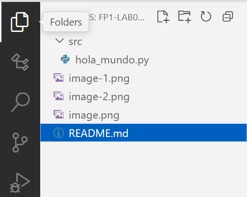
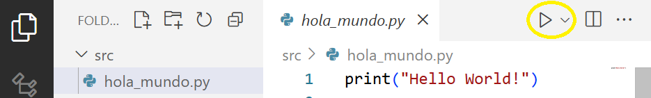
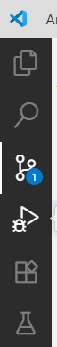

# 🌱 Proyecto de Laboratorio: Introducción al uso de Git y GitHub desde Visual Studio Code
## Fundamentos de Programación 1. Grado en Ingeniería Informática - Inteligencia Artificial (Universidad de Sevilla)

En este primer laboratorio vamos a aprender cómo trabajar con **repositorios** en GitHub mediante la herramient Git en Visual Studio Code. Los pasos que aquí aprenderemos serán los que utilizaremos en el resto de laboratorios de la asignatura.

---

## Requisitos previos

Si vas a trabajar en tu propio ordenador, debes tener instalado el siguiente software:

* **Intérprete de Python 3**: 
    1.  **Descargar el instalador**: Ve a la [página oficial de Python](https://www.python.org/downloads/windows/) y descarga la última versión estable para Windows (o para el sistema operativo de tu ordenador).
    2.  **Ejecutar el instalador**: Abre el archivo descargado. Es muy importante que marques la casilla que dice **"Add Python to PATH"** antes de hacer clic en "Install Now". Esto te permitirá ejecutar Python desde cualquier terminal.
    3.  **Verificar la instalación**: Abre una terminal (pulsa la tecla Windows, escribe `cmd` o `powershell`, y presiona Enter) y escribe `python --version`. Si la instalación fue correcta, verás la versión de Python que acabas de instalar.

* **Visual Studio Code**: Descárgalo desde su [página oficial](https://code.visualstudio.com/) e instálalo como cualquier otro programa.

* **Git**: Descárgalo desde su [página oficial](https://git-scm.com/downloads) e instálalo como cualquier otro programa. Durante la instalación verás muchas opciones configurables, puedes dejar todas las opciones por defecto y pulsar el botón "Siguiente" hasta completar la instalación.

* **Cuenta en GitHub**:
    1.  **Registrarse**: Accede a la [página de registro de GitHub](https://github.com/join).  
    2.  **Completar los datos**: Introduce un nombre de usuario, correo electrónico y contraseña.  
    3.  **Confirmar la cuenta**: Revisa tu correo electrónico y sigue el enlace de verificación que te enviará GitHub.  
    4.  **Configurar perfil básico**: Una vez dentro, puedes añadir una foto y otros datos de perfil si lo deseas.

---

## ⏱ Duración estimada

2 horas

---

## ✅ ¿Qué se practica?
- Crear tu propio repositorio en GitHub a partir de un repositorio plantilla.
- Clonar un repositorio en GitHub a tu ordenador y trabajar en él desde Visual Studio Code.
- Registrar los cambios que hagas en el repositorio y subirlos a tu repositorio en GitHub.

---

## ¿Qué es Git?
Git es un **sistema de control de versiones**, una herramienta que permite registrar y gestionar los cambios realizados en los archivos de un proyecto a lo largo del tiempo. Esto es fundamental en programación, ya que facilita trabajar en equipo, recuperar versiones anteriores y mantener un historial de modificaciones, evitando la pérdida de trabajo y los conflictos entre colaboradores.

Un **repositorio** es el lugar donde se almacenan todos los archivos y el historial de cambios de un proyecto. Existen dos tipos principales:
- **Repositorio local**: Es el que tienes en tu propio ordenador, donde trabajas y guardas los cambios de forma privada.
- **Repositorio remoto**: Es una copia del repositorio alojada en un servidor (por ejemplo, en GitHub), accesible para otros usuarios y utilizada para compartir el trabajo.

Las operaciones básicas en Git son:
- **Commit**: Registrar los cambios realizados en el repositorio local, añadiendo un mensaje que describe lo que se ha modificado.
- **Push**: Subir los cambios guardados en el repositorio local al repositorio remoto, para que otros puedan verlos y trabajar con ellos.
- **Pull**: Descargar los cambios más recientes del repositorio remoto al repositorio local, asegurando que tienes la última versión del proyecto.

Gracias a Git, puedes colaborar de forma segura y eficiente en proyectos de programación, manteniendo siempre el control sobre el historial y la evolución del código.

## Trabajando con Git y GitHub: Primeros pasos

En este documento se explican los pasos para trabajar con los proyectos de laboratorio, usando Git y GitHub. Debes tener instalado Git en tu ordenador, y haberte creado una cuenta en GitHub (suponemos que ya estás logueado antes de los pasos que se explican a continuación).

### 📌 Ejercicio 1. Crea tu propio repositorio a partir de la plantilla

Cada proyecto de laboratorio es una **plantilla** (*template*) que cada alumno debe usar para crear su propio repositorio personal. Sigue estos pasos:

1. Accede al repositorio de la plantilla en GitHub usando un navegador web (deberías tenerlo ya abierto si estás leyendo estas instrucciones).
2. Mantén pulsada la tecla `Ctrl` y haz clic en el botón verde **"Use this template"** (puede aparecer también como **"Use template"**). Si no ves este botón, es posible que no te hayas logueado en GitHub (¡hazlo!).
3. Selecciona **"Create a new repository"***.
4. Escribe un nombre para tu repositorio en el campo **"Repository name"** (es recomendable que uses el mismo nombre del repositorio que estás copiando, por ejemplo `FP1-LAB00-Introduccion-a-VSC-Git-y-GitHub`).
5. Pulsa **"Create repository"**.

Esto generará un nuevo repositorio en tu cuenta de GitHub, con el contenido de la plantilla. Sabrás que el repositorio ahora es de tu propiedad mirando la URL que aparece en la barra de direcciones del navegador; debe ser algo como `https://github.com/tu_usuario/FP1-LAB00-Introduccion-a-VSC-Git-y-GitHub`.

---

### 📌 Ejercicio 2. Clona el repositorio en Visual Studio Code

Una vez creado tu repositorio personal, sigue estos pasos para **clonarlo** en tu ordenador:

1. Abre **Visual Studio Code**. Asegúrate de que no tienes abierta ninguna carpeta (o ciérrala, en su caso, mediante el menú **"Archivo"** -> **"Cerrar carpeta"**)
2. Haz clic en el **icono de Control de Código Fuente** en la barra lateral izquierda (el símbolo de ramas de Git).


3. Pulsa en el botón **"Clonar repositorio"**.
> 💡 Alternativamente, puedes usar `Ctrl+Shift+P` y buscar **Git: Clone** si no ves el botón directamente.
4. Cuando VS Code te pida la URL, ve a **tu nuevo repositorio** en GitHub:

   * Pulsa el botón verde **"Code"**.
   * Copia la URL que aparece bajo la opción **HTTPS**, que tendrá este aspecto:

     ```
     https://github.com/tu_usuario/FP1-LAB00-Introduccion-a-VSC-Git-y-GitHub.git
     ```
5. Vuelve a VS Code, **pega la URL**, y pulsa Enter.
6. Elige una carpeta de tu ordenador donde guardar el proyecto.
7. VS Code te preguntará si deseas abrir el proyecto recién clonado. Pulsa **"Abrir"**.
8. Ahora puede abrir el archivo `README.md`desde el explorador de archivos de VS Code, y seguir las instrucciones del resto de ejercicios directamente desde allí.
💡 Para visualizar correctamente el contenido del archivo, haga clic con el botón derecho y pulse en **"Abrir previsualización"**.

---

### 📌 Ejercicio 3. Configura tu nombre y correo en Git

Git necesita saber quién eres para registrar correctamente tus cambios. Esta configuración se hace **solo una vez por entorno**. Es decir, si lo haces hoy en tu propio ordenador, el próximo día que tengas que trabajar en otro repositorio de la asignatura no tendrás que hacerlo.

#### ✅ Si vas a trabajar en **tu propio ordenador** (configuración global):

Abre un terminal (menú **"Ver"** -> **"Terminal"**, o pulsa `Ctrl + ñ`) y escribe:

```bash
git config --global user.name "Tu Nombre"
git config --global user.email "tu.email@alum.us.es"
```

Esto guardará tu identidad para todos los repositorios que uses en ese equipo. Ya no tendrás que hacerlo para otros proyectos.

---

#### 🧪 Si estás usando un **ordenador del aula** (configuración local):

Abre un terminal **dentro de la carpeta del repositorio clonado** (es la carpeta donde estarás si abres el terminal ahora) y escribe:

```bash
git config user.name "Tu Nombre"
git config user.email "tu.email@alum.us.es"
```

Esto asegura que tu identidad se aplique solo en este proyecto, sin afectar a otros. Deberás repetir el proceso para cada nuevo proyecto en el que trabajes.

---

Puedes comprobar la configuración activa escribiendo este comando en el terminal con:

```bash
git config --list
```

Deberías observar en el listado dos entradas `user.name` y `user.email`.

---
### 📌 Ejercicio 4. Ejecuta el módulo `hola_mundo.py`

El repositorio contiene un módulo `hola_mundo.py` muy simple: tan solo muestra en el terminal un mensaje de saludo. Este módulo está en la carpeta `src` (acrónimo de "source", que significa "código fuente"). 

Para ejecutar un módulo tenemos dos opciones

#### Desde el terminal
1. Abre un terminal, y escribe lo siguiente:

```bash
python src/hola_mundo.py
```

#### Desde la interfaz de VSC

 Pincha en el fichero `hola_mundo.py` en el explorador de archivos para mostrar su contenido. El explorador de archivos puede mostrarse y ocultarse pulsando en el botón correspondiente de la barra lateral izquierda:



Ahora puedes ejecutar el módulo pulsando el botón de ejecución:



También puedes usar la paleta de comandos, que se abre pulsando la tecla `F1` o también con `Ctrl + Mayúsc. + P`. La paleta de comandos permite acceder a las distintas funciones que ofrece VSC. Escribiendo el nombre de la función, se realiza una búsqueda y se muestran múltiples resultados en una lista que puedes seleccionar. Prueba a escribir **"Run Python"** y escoge la primera opción que se muestra en la lista de resultados.

---

### 📌 Ejercicio 5. Registra cambios en el proyecto (commit) y sube esos cambios a GitHub

Modifica el programa que encontrarás en el archivo `src/hola_mundo.py` para que el mensaje de saludo se muestre **en español**. Guarda los cambios pulsando `Ctrl+S` o en el menú **"Archivo"** **"Guardar"**. Ejecuta el programa para asegurarte de que no hemos "roto" nada, antes de proceder a guardar estos cambios en nuestro repositorio.

💡 Puedes activar la opción de auto guardado en el menú **"Archivo"**, de esta manera todos los cambios que vayas realizando en los archivos se irán guardando automáticamente.

Observa que aparece un número encima del icono de control de cambios:



Esto indica el número de archivos con cambios detectados en el repositorio. Sigue los siguientes pasos para registrar dichos cambios (**commit**) y para subirlos al repositorio remoto en GitHub (**push**).

1. Haz clic en el **icono de Control de Código Fuente** en la barra lateral izquierda.
2. Verás una lista de archivos modificados (sólo debería aparecer `hola_mundo.py`). Añade un **mensaje de commit** en la parte superior (por ejemplo: `Traducido el mensaje de saludo a español`).
3. Pulsa el botón **✓Confirmación** o **Commit** para hacer el commit. Si te pregunta si quieres seleccionar todos los archivos con cambios, contesta que **Sí**.
> 💡 Alternativamente, cuando estés trabajando en tus proyectos, si has hecho cambios en varios archivos y sólo quieres registrar algunos de ellos en este commit, puedes seleccionar los archivos que quieres incluir situándote encima y pulsando el botón **+**.
4. En la barra inferior, en la parte de la izquierda debes tener algo como esto: 

.

Esto significa que hay 1 commit que aún no se ha subido al repositorio remoto de GitHub. Pulsa sobre el icono de las flechas y pulsa el botón **Aceptar** para subir el commit a GitHub (**push**).

5. Si es la primera vez que usas GitHub desde VS Code, puede que te pida iniciar sesión. Selecciona **"Sign in with browser"** (el mensaje puede variar), se abrirá el navegador y debe pulsar el botón de autorización en la parte inferior. 

6. Para saber si has realizado los pasos correctamente, **accede a tu repositorio en GitHub** y comprueba que el archivo `src/hola_mundo.py` contiene los cambios efectuados.

---
### ⭐ Ejercicio extra. 

Crea un nuevo módulo `saludo.py` y escribe en él un programa que realice un saludo personalizado según la hora del día. El programa pedirá al usuario que introduzca su nombre, y le saludará de una manera u otra según cuál sea la hora actual:

* Si la hora es menor a 12, el saludo será `¡Buenos días, NOMBRE!`
* Si la hora está comprendida entre las 12 y las 20, el saludo será `¡Buenas tardes, NOMBRE!`
* Si la hora está comprendida entre las 21 y las 23, el saludo será `¡Buenas noches, NOMBRE!`.

Para saber cuál es la hora actual, utiliza estas instrucciones al inicio de tu programa:

```python
from datetime import datetime

hora_actual = datetime.now().hour
```

**NOTA**: Estudiaremos el módulo `datetime` y todo lo que podemos hacer con él en el tema 3 de teoría.

#### Pruebas

Ejecuta tu programa y comprueba que funciona adecuadamente. Para simular que la hora cambia, comenta la línea donde se inicializa la hora actual e incluye una inicialización falsa a la hora que quieras probar. Haz pruebas con horas de cada uno de los intervalos indicados.

#### Commit y push

Una vez comprobado que el programa funciona correctamente, registra los cambios en el repositorio (*commit*) y súbelos al repositorio remoto (*push*).

